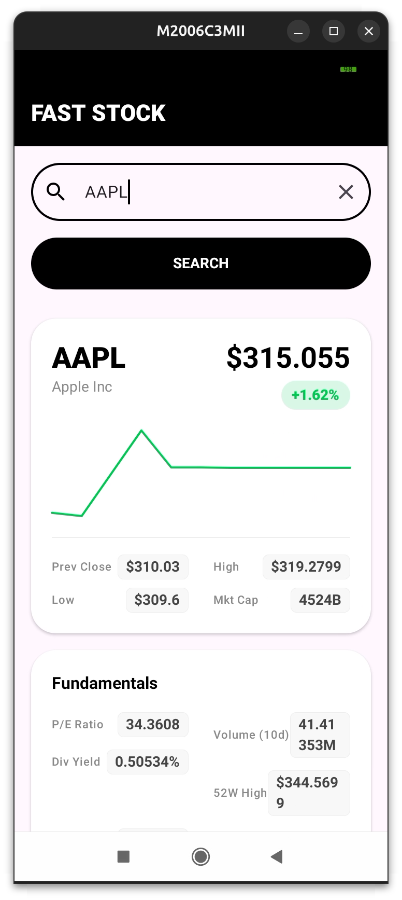
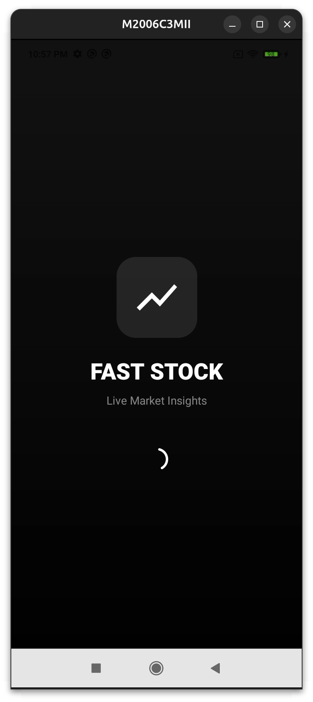

# FAST STOCK 

A sleek, real-time market tracking application built with **Kotlin Multiplatform (KMP)** and **Compose Multiplatform**. Designed with a minimalist, black-and-white aesthetic, this app delivers live financial data, sparkline charts, and core market fundamentals across Android and iOS from a single shared codebase.

## Features
* **Real-Time Data:** Live WebSocket integration for instantaneous price updates.
* **Interactive UI:** Dynamic sparkline charts built natively with Compose Canvas.
* **Market Fundamentals:** Comprehensive data grid including P/E ratios, Market Cap, and 52-week ranges.
* **Cross-Platform:** Shared networking, state management, and UI logic.
* **Minimalist Design:** Clean, high-contrast monochrome interface with intuitive colored data pills.

## Screenshots

|                      Search & Real-Time Chart                      |                          Loading Screen                          |
|:------------------------------------------------------------------:|:----------------------------------------------------------------:|
|  |  |

## Tech Stack
* **UI:** Compose Multiplatform (Material 3)
* **Networking:** Ktor Client (OkHttp engine) & WebSockets
* **Serialization:** Kotlinx.Serialization
* **Concurrency:** Kotlin Coroutines & Flows
* **Market API:** Finnhub REST & WebSocket APIs